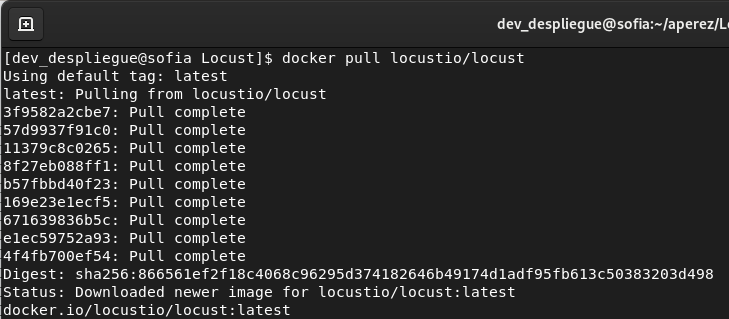

# DOCUMENTACIÓN LOCUST

## Indice
 - [Funcionamiento de Locust](#funcionamiento-de-locust)
 - [Herramientas similares a Locust](#herramientas-similares-a-locust)
   - [Locust](#locust)
   - [Apache JMeter](#apache-jmeter)
   - [Gatling](#gatling)
 - [Implementación en Docker](#implementacion-en-docker)
 - [Demostración Locust](#demostracion-locust)
 - [Fuentes de consulta](fuentes-de-consulta)

## Funcionamiento de Locust
Locust es una herramienta de testing basada en Python y es usada para prueba de cargas y simulación del comportamiento de usuarios. La prueba de carga es la práctica de testear una aplicación de software con el propósito de estresar las capacidades de la aplicación, es decir, determinar el punto de ruptura principal de la aplicación en términos de rendimiento y seguridad. Por lo tanto, Locust crea un conjunto de funciones de prueba que simulan una gran cantidad de usuarios. 

Adicionalmente, Locust ofrece un conjunto de procesos llamados nodos que se pueden usar para ejecutar un conjunto de tareas. Estos nodos se conocen como trabajadores ya que realizan funciones específicas en un período determinado. Y se ofrece la capacidad de vincular estos nodos para simular una carga distribuida para operaciones de prueba de carga a gran escala. 

Asimismo, Locust se puede usar como una biblioteca que encapsula el entorno de prueba usando Python. Esta biblioteca contiene métodos preempaquetados para probar sus procedimientos, funciones o métodos de clase.

Finalmente, después de crear las pruebas, se pueden ejecutar en BlazeMeter que brinda informes en tiempo real con la capacidad de guardarlos para realizar comparaciones futuras para lograr una mayor escalabilidad, opciones de informes avanzadas, etc. De igual manera, se puede usar Taurus para monitorear y analizar los resultados de las pruebas o  exportar métricas con Prometheus y mostrarlas en un enfoque visualmente descriptivo usando los paneles de Grafana.

[Regresar al inicio](#indice)

## Herramientas similares a Locust 
### Locust

**Ventajas:**
* Debido a que está basada en Python, la implementación es más rápida y fácil.
* Requiere menos utilización de CPU y puede ser usada con recursos limitados.
* El modelo de simulación está basado en un enfoque asíncrono, esto permite que se simulen fácilmente miles de usuarios en un mismo dispositivo.
* Cuando el servidor comienza, se pueden dar elementos de entrada para personalizar la carga. Locust solo soporta carga lineal.
* Provee un monitoreo en tiempo real cuando se vincula con otras herramientas para capturar las métricas y mostrarlas.
* Tiene un grupo de visualizaciones y reportes de prueba que resumen el proceso de prueba de cargas. 
* Proporciona una imagen completa de la ejecución de prueba actual. 
* Corre múltiples scripts de prueba para encontrar la principal ejecución y problemas de carga.
* Incrementa el número de casos de prueba y compara los resultados para cada tarea, usuario y petición. 
* Fue principalmente construido para pruebas basadas en HTTP pero puede extenderse para otros protocolos escribiendo una función propia Python. 
* Tiene una implementación basada en eventos, por lo que es altamente escalable.
* La implementación de pruebas a nivel de código permite la colaboración.

**Desventajas:**
* Debido a la naturaleza de Python, cuanto mayor sea el número de usuarios simulados, más lenta será la ejecución del código.
* No soporta picos de carga.
* Los picos de carga repentinos no se pueden probar.
* Se necesitan conocimientos básicos de Python para crear pruebas de rendimiento.
* Tiene una capacidad de monitoreo limitada, sin embargo, proporciona casi toda la información requerida para monitorear una carga básica en un servidor web. 
* La principal limitación para la escalabilidad es el bloqueo del intérprete global de Python. Locust hace el esfuerzo de evitar esta limitación al permitirle activar una prueba de carga distribuida, pero eso agrega complejidad a la ejecución de pruebas de carga aún más pequeñas.
* Los scripts pueden resultar difíciles cuando se trabaja con una prueba compleja.

### Apache JMeter
Herramienta, basada en Java, diseñada para probar el rendimiento del software funcional de aplicaciones basadas en web. Las aplicaciones pueden probarse para recursos estáticos como dinámicos lo que permite probar el rendimiento, la resistencia y la  confiabilidad. Esta herramienta diseña un plan de prueba para generar un archivo .jmx, ejecutar la prueba y, finalmente, ver de distintas formas los resultados de la ejecución. 

**Ventajas:**
* Código abierto. 
* El modo GUI de JMeter es un cliente de escritorio que permite construir pruebas rápidas y simples sin escribir líneas de código. 
* Sin código, se pueden probar varios protocolos y bases de datos como JDBC, FTP, LDAP, SMTP, HTTP, HTTPS, SOAP,  XML-RPC, POP3, IMAP, SMTP, JMS y TCP. 
* Ofrece plugins adicionales que permiten crear una carga flexible. 
* Es la herramienta de prueba más utilizada. 
* Tiene una funcionalidad integrada para la grabación de scripts. 

**Desventajas:**
* No se comporta como un navegador. 
* No guarda ni envía cookies.
* No interpreta código JavaScript.
* El tester trabaja a nivel de protocolos por lo que normalmente el tester tiene que apoyarse en herramientas adicionales.
* Los listeners consumen bastantes recursos de CPU. Por lo anterior, generalmente,  JMeter se ejecuta con un modo sin interfaz gráfica.
* Utiliza un enfoque basado en subprocesos, lo que significa que cada usuario obtiene su propio subproceso.
* Sin soporte para DevOps debido a la antigüedad.

### Gatling
Gatling es una herramienta de prueba de carga, basada en Java, que se puede utilizar para un entorno de desarrollo integrado, sistemas de control de versiones y soluciones de integración continua. Se basa en Akka, que es un kit de herramientas para crear aplicaciones distribuidas controladas por mensajes. Es un marco distribuido que permite la computación totalmente asincrónica.

**Ventajas:**
* Soporta varios protocolos populares como HTTP, MQTT, ZeroMQ, AMQP, websockets, eventos server-sent y JMS.
* Gatling soporta el aumento de los usuarios con picos de carga.
* La grabación de simulación ayuda a acelerar el proceso de prueba. 
* Fácil de usar.
* Código abierto.  
* Maneja usuarios virtuales con sus propios datos y los implementa como mensajes por lo que puede manejar miles de usuarios simultáneos.
* Cuando la simulación está completa, se puede ver un reporte en el navegador.
* Enfoque de línea de comandos.
* Da un informe de análisis visualmente descriptivo.
* Debido a que utiliza computadora asíncrona, reduce el impacto en el rendimiento de tener muchos usuarios en un solo subproceso.
* No es necesario que la GUI cree y ejecute pruebas.

**Desventajas:**
* Debido a que está basado en Java, están presentes las dificultades de configuración y las dependencias.
* La versión gratuita tiene un número limitado de características.
* La CLI no proporciona mucha información detallada durante el tiempo de ejecución.
* Para el monitoreo en vivo a través de una interfaz web gráfica, debe integrarse en otra aplicación llamada Taurus.
* Tiene un rendimiento promedio.

[Regresar al inicio](#indice)

## Implementacion en Docker
Para comenzar la implementación en Docker, se tiene que descargar la imagen que se encuentra en Docker Hub, esto mediante el comando

```
docker pull locustio/locust
```


Posteriormente, se va a crear un contenedor de Locust en Docker usando el siguiente comando

```
docker run -p 8089:8089 -v $PWD:/mnt/locust locustio/locust -f /mnt/locust/locustfile.py
```


Desglosando el comando, se tiene que,

&nbsp;&nbsp;&nbsp;&nbsp;*docker run* - ejecuta el contenedor 

&nbsp;&nbsp;&nbsp;&nbsp;*-p 8089:8089* - empareja el contenedor oficial de locust en docker y localhost en el entorno. De esta manera, se están ejecutando los archivos Locust en http://localhost:8089/. Dicho emparejamiento permite ejecutar el archivo de prueba de locust en el entorno del contenedor docker. 

&nbsp;&nbsp;&nbsp;&nbsp;*-v $PWD:/mnt/locust locustio/locust* - el parámetro -v monta el directorio de la máquina local con el directorio del contenedor locust de Docker. Esto funciona de tal manera que todo se sincroniza entre ambos directorios. Esta sincronización permite que la información sobre las estadísticas de prueba esté disponible en el directorio local.

&nbsp;&nbsp;&nbsp;&nbsp;*-f /mnt/locust/locustfile.py* - Locust debe almacenarse en el directorio de trabajo actual. Por lo tanto, se copia y pega el archivo en dicho directorio. 

Una vez ejecutado el comando, se puede abrir el navegador y se debe observar la web-UI de Locust correctamente. Además, el registro se muestra en la terminal. 


Es importante mencionar que el archivo de locustfile.py es un archivo de prueba donde se ejecutarán todos los casos de prueba que se deseen probar en la aplicación.  Básicamente, este archivo se utiliza para probar la aplicación probando los métodos y procedimientos necesarios.

Entonces, para escribir un archivo de prueba sencillo, se debe empezar por importar las clases y métodos necesarios. 

```
import time
from locust import HttpUser, task, between
```

Posteriormente, se define una clase para los usuarios que se van a simular, ésta hereda de HttpUser, que le da a cada usuario un atributo de cliente, que es una instancia de HttpSession, que se puede usar para realizar solicitudes HTTP al sistema de destino que se quiere cargar. Cuando comienza una prueba, Locust creará una instancia de esta clase para cada usuario que simula y cada uno de estos usuarios comenzará a ejecutarse dentro de su propio subproceso. 

Es importante mencionar que para que un archivo sea un archivo locust válido, debe contener al menos una clase heredada de Usuario.

```
class QuickstartUser(HttpUser):
```
	
Dentro de la clase, se define un tiempo de espera que hará que los usuarios simulados esperen entre 1 y 5 segundos después de ejecutar cada tarea. 

```
wait_time = between(1, 5)
```

Asimismo, se definen las tareas usando la anotación @tasks que especifica las tareas del usuario. Para cada usuario que ejecuta, Locust crea un micro-hilo que llamará a esos métodos.

```
@task
	def hello_world(self):
    		self.client.get("/hello")
    		self.client.get("/world")

	@task(3)
	def view_items(self):
    		for item_id in range(10):
        			self.client.get(f"/item?id={item_id}", name="/item")
        			time.sleep(1)

	def on_start(self):
    		self.client.post("/login", json={"username":"foo", "password":"bar"})
```

En este ejemplo se han declarado dos tareas, a una de ellas se le ha dado un mayor peso (3). Cuando el QuickstartUser se ejecute, elegirá una de las tareas declaradas, en este caso hello_world o view_items y la ejecutará. Al ponerle un peso de 3, hará que Locust tenga tres veces más probabilidades de elegir view_items que hello_world. Cuando una tarea ha terminado de ejecutarse, el Usuario dormirá durante el tiempo de espera y después elegirá una nueva tarea y la seguirá repitiendo.

Por un lado, en la tarea hello_world, el atributo self.client permite realizar llamadas HTTP que Locust registrará y se usa get para llamar a la acción probada. Por otro lado, en la tarea view_items se cargan 10 URL diferentes usando un parámetro de consulta variable y se usa el parámetro de nombre para agrupar todas esas solicitudes en una entrada llamada "/item". Y, por último, se declaró un método on_start que se llama para cada usuario simulado cuando se inicia.

Para más información de cómo crear un archivo de prueba, consultar [2]. 

[Regresar al inicio](#indice)

## Demostracion Locust
Con todo lo anterior, se puede hacer la demostración ingresando los parámetros correspondientes en la pantalla principal del navegador. Al darle en iniciar, aparece una nueva pantalla donde se puede navegar a través de las distintas pestañas. 


La primera pestaña muestra las estadísticas, es decir, el número de solicitudes, el número de fallos, la media de tiempo, etc. 


En la segunda pestaña nos muestra las estadísticas en formato de gráficas. 


En la tercera y cuarta pestaña se pueden observar los fallos y excepciones, en caso de que existan.


En la quinta pestaña se muestra la relación por usuario con las tareas probadas. 


Y, finalmente, en la última pestaña se puede descargar el reporte en formato CSV. 

Adicionalmente, al parar el proceso de Locust en la terminal, se muestra un reporte. 


[Regresar al inicio](#indice)


## Fuentes de consulta 

[1] Chercher Tech. (s.f.). *Locust Test on Docker*. Recuperado de: https://chercher.tech/locust-python/locust-docker

[2] Locust docs. (s.f.). *Writing a locustfile*. Recuperado de: https://docs.locust.io/en/stable/writing-a-locustfile.html

[3] Chercher Tech. (s.f). *Locust Web Interface statistics*. Recuperado de: https://chercher.tech/locust-python/locust-web-ui

[4] Universidad de California en Los Angeles. (s.f.). *Quick Tutorial on Locust*. Recuperado de: http://oak.cs.ucla.edu/refs/locust/index.html

[5] Echout, M. (10 de marzo de 2022). *What is Locust Load Testing?* Recuperado de: https://www.blazemeter.com/blog/locust-load-testing 

[6] Damburagamage, C. (31 de enero de 2022). *Gatling vs Locust: What are the differences and when to use them?* Recuperado de: https://www.blazemeter.com/blog/gatling-vs-locust 

[7] Miles, L. (25 de febrero de 2021). *Choosing the right lad testing tool - JMeter vs Locust vs Goose.* Recuperado de: https://www.tag1consulting.com/blog/jmeter-vs-locust-vs-goose 

[8] Loadium. (19 de octubre de 2021). *JMeter vs. Locust | Choosing The Right Load Testing Tool – Part1.* Recuperado de: https://loadium.com/blog/jmeter-vs-locust-part1 

[9] Bushnev, Y. (16 de octubre de 2020). *JMeter vs Locust: Which one should you choose?* Recuperado de: https://www.blazemeter.com/blog/jmeter-vs-locust 

[10] Loadview. (9 de noviembre de 2021). *Pruebas de carga de Gatling: Cómo hacerlo, Pruebas distribuidas y ejemplos.* Recuperado de: https://www.loadview-testing.com/es/blog/pruebas-de-carga-de-gatling-como-hacerlo-pruebas-distribuidas-y-ejemplos/

[Regresar al inicio](#indice)
